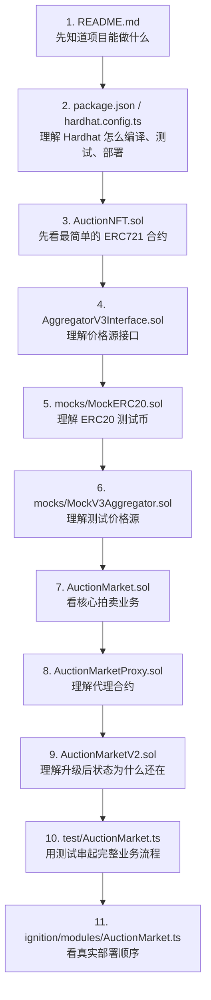
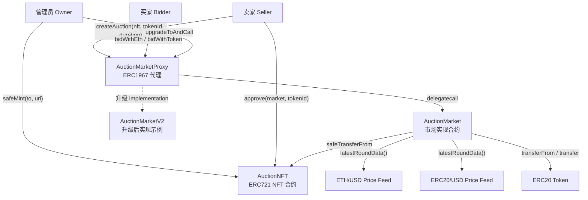
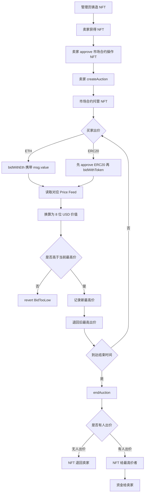
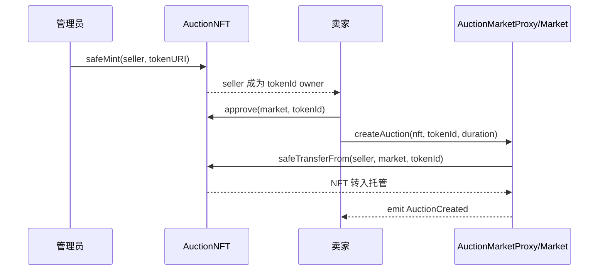
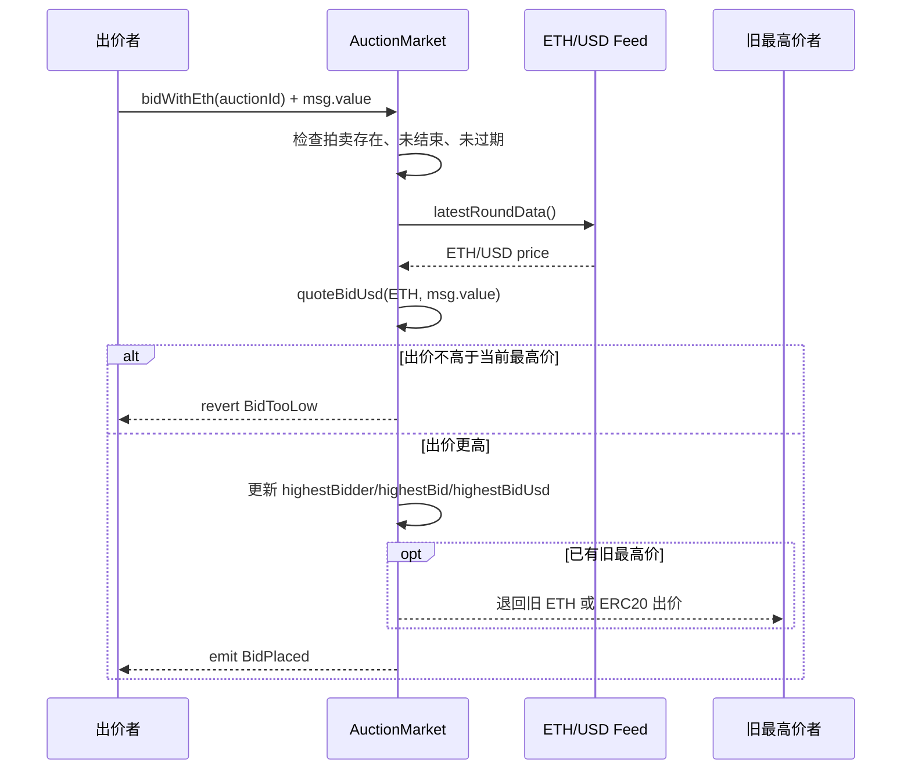
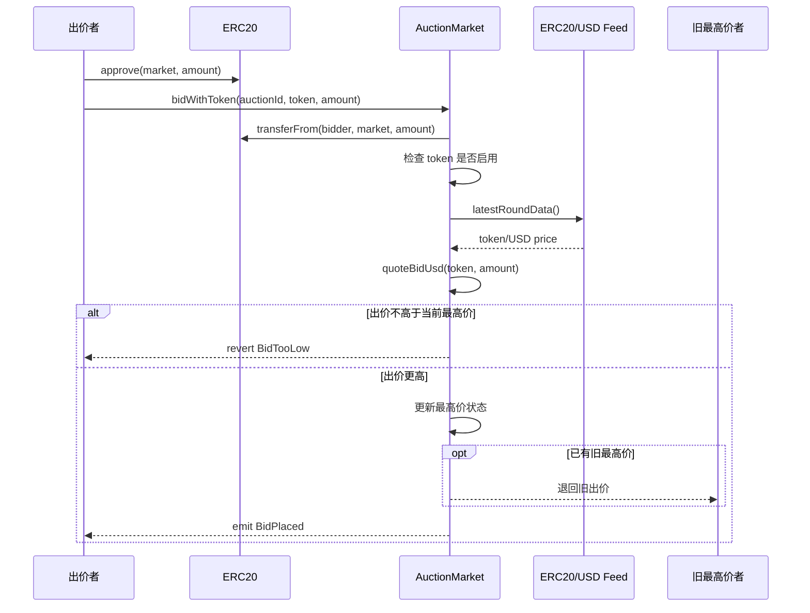
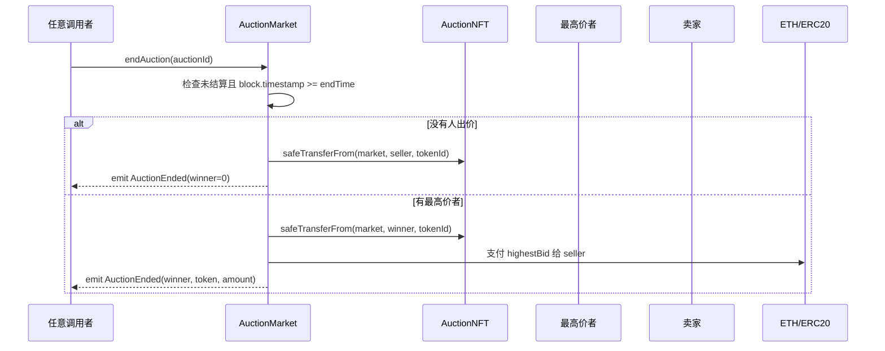
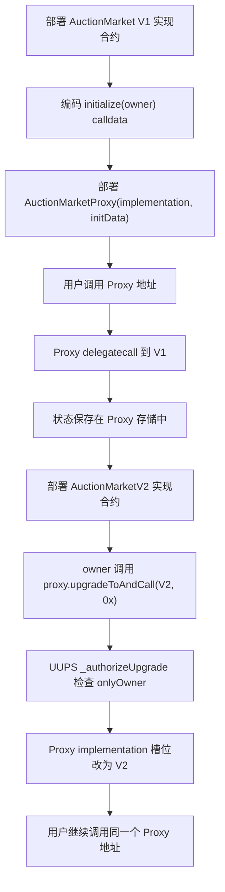
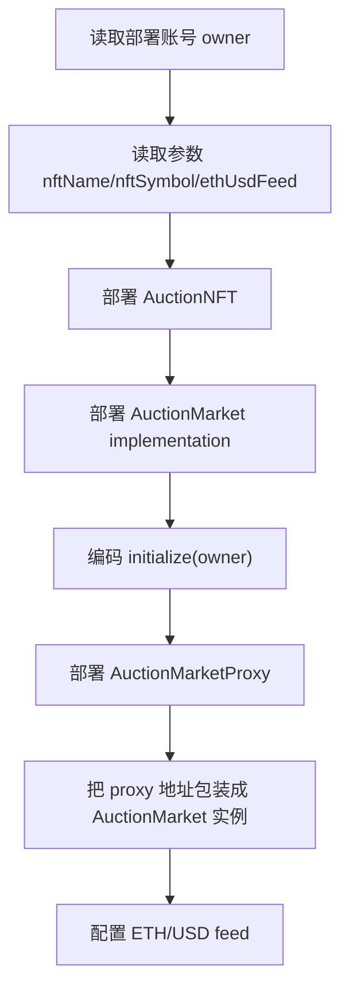
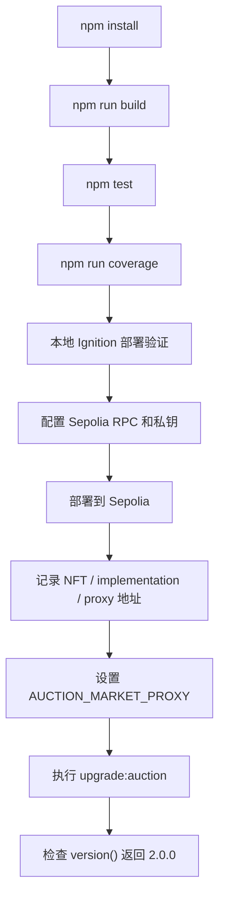

# NFT 拍卖市场工程说明文档

本文档用于帮助理解这个 Hardhat + Solidity 项目。重点不是只列出“有哪些文件”，而是解释每个合约为什么存在、业务流程怎样走、Hardhat 如何把 Solidity 合约编译、测试和部署到链上。

如果你对代理合约和升级机制还不熟，建议配合阅读专题文档：[`PROXY_AND_UPGRADE_GUIDE.md`](PROXY_AND_UPGRADE_GUIDE.md)。

## 1. 项目目标

本项目实现一个 NFT 拍卖市场：

- 使用 ERC721 标准实现 NFT 合约，支持铸造、授权、转移。
- 用户可以把 NFT 上架拍卖。
- 买家可以用 ETH 或白名单 ERC20 出价。
- 合约使用 Chainlink Price Feed 风格接口读取 ETH/USD 或 ERC20/USD 价格，把不同资产的出价统一换算为 USD 后比较。
- 拍卖结束后，NFT 转给最高价者，资金转给卖家。
- 市场合约使用 UUPS 代理模式，后续可以升级实现合约。
- 使用 Hardhat 3 编译、测试、生成覆盖率报告，并通过 Ignition 模块部署。

## 2. 工程目录结构

```text
my-hardhat3-projet/
  contracts/
    AuctionNFT.sol
    AuctionMarket.sol
    AuctionMarketProxy.sol
    AuctionMarketV2.sol
    interfaces/
      AggregatorV3Interface.sol
    mocks/
      MockERC20.sol
      MockV3Aggregator.sol
    Counter.sol
    Counter.t.sol
  ignition/
    modules/
      AuctionMarket.ts
      Counter.ts
  test/
    AuctionMarket.ts
    Counter.ts
  hardhat.config.ts
  package.json
  README.md
```

目录职责：

| 目录或文件 | 作用 |
| --- | --- |
| `contracts/` | Solidity 合约源码。主业务合约、代理合约、mock 合约都在这里。 |
| `contracts/interfaces/` | Solidity 接口定义。这里放 Chainlink Price Feed 兼容接口。 |
| `contracts/mocks/` | 测试专用合约，用于模拟 ERC20 和价格预言机。 |
| `test/` | TypeScript 集成测试，使用 Hardhat 3 + ethers + Mocha。 |
| `ignition/modules/` | Hardhat Ignition 部署模块。 |
| `hardhat.config.ts` | Hardhat 配置，包括 Solidity 版本、网络、插件。 |
| `package.json` | npm 脚本和依赖。 |

## 3. 建议阅读顺序

如果你是为了理解 Solidity 和 Hardhat，建议不要一开始就直接看 `AuctionMarket.sol`。市场合约功能最多，里面同时包含拍卖、出价、价格换算、退款、结算、升级权限，直接看容易混在一起。

推荐按下面顺序阅读：



### 3.1 第一步：先看 README.md

先看 README 的目的不是学代码，而是建立项目全貌：

- 这个项目是 NFT 拍卖市场。
- 支持 ETH/ERC20 出价。
- 出价会换算成 USD 比较。
- 市场合约使用 UUPS 代理升级。
- 测试和部署命令是什么。

看完 README 后，再进入源码会更容易知道每个文件在解决什么问题。

### 3.2 第二步：看 package.json 和 hardhat.config.ts

先理解 Hardhat 工程入口：

| 文件 | 重点看什么 |
| --- | --- |
| `package.json` | `scripts` 里有哪些命令，例如 `build`、`test`、`coverage`、`typecheck`。 |
| `hardhat.config.ts` | Solidity 版本、插件、网络配置、Sepolia RPC/private key 从哪里读取。 |

这一步帮助你理解：Solidity 代码不是单独运行的，它需要 Hardhat 编译、测试、部署。

### 3.3 第三步：先看 AuctionNFT.sol

推荐第一个看的合约是 `AuctionNFT.sol`。

原因：

- 它最短。
- 功能单一：只负责 NFT 铸造和标准 ERC721 行为。
- 可以先理解 `contract`、`constructor`、`state variable`、`onlyOwner`、`external function`。
- 先理解 NFT 是怎么来的，后面才能理解为什么拍卖市场要托管 NFT。

阅读重点：

```text
nextTokenId       下一个 NFT 编号
constructor       设置 NFT 名称、符号、owner
safeMint          只有 owner 能铸造 NFT
_safeMint         OpenZeppelin 提供的安全铸造逻辑
_setTokenURI      保存 NFT 元数据地址
```

### 3.4 第四步：看 AggregatorV3Interface.sol

这个文件不是业务合约，而是接口。接口只说明“外部合约应该有什么函数”，不写具体实现。

阅读重点：

- `decimals()`：价格源精度。
- `latestRoundData()`：读取最新价格。
- `answer`：价格值。
- `updatedAt`：价格更新时间。

理解这个接口后，再看市场合约里的 `quoteBidUsd` 会更容易。

### 3.5 第五步：看 mocks 目录

再看两个测试合约：

| 文件 | 作用 |
| --- | --- |
| `MockERC20.sol` | 模拟 ERC20 支付 token，测试 ERC20 出价。 |
| `MockV3Aggregator.sol` | 模拟 Chainlink 价格源，测试 USD 换算。 |

mock 合约不是生产功能，而是为了测试。它们让测试可以控制余额和价格，避免依赖真实链上资产。

### 3.6 第六步：再看 AuctionMarket.sol

现在再看核心市场合约。建议按函数顺序分块看，不要一次读完整文件：

| 阅读顺序 | 代码位置 | 先理解什么 |
| --- | --- | --- |
| 1 | `struct Auction` | 一场拍卖需要保存哪些状态。 |
| 2 | `struct PaymentTokenConfig` | 一个支付资产如何绑定价格源。 |
| 3 | `setPaymentToken` | 管理员如何开启 ETH/ERC20 出价。 |
| 4 | `createAuction` | 卖家如何上架 NFT，市场如何托管 NFT。 |
| 5 | `bidWithEth` | ETH 出价入口。 |
| 6 | `bidWithToken` | ERC20 出价入口。 |
| 7 | `quoteBidUsd` | 如何读取价格并换算 USD。 |
| 8 | `_placeBid` | 如何比较出价、记录最高价、退款旧出价。 |
| 9 | `endAuction` | 如何结束拍卖并结算 NFT/资金。 |
| 10 | `_authorizeUpgrade` | UUPS 升级权限为什么只有 owner。 |

这样读会比较清楚：先看“数据结构”，再看“用户入口”，最后看“内部逻辑”。

### 3.7 第七步：看代理和升级相关合约

看完市场业务后，再看：

- `AuctionMarketProxy.sol`
- `AuctionMarketV2.sol`

阅读重点：

- 用户调用的是 proxy 地址。
- proxy 通过 `delegatecall` 执行 implementation 逻辑。
- 状态保存在 proxy 中。
- 升级只是把 implementation 从 V1 换成 V2。
- `AuctionMarketV2` 保留 `version()` 用于证明升级成功，同时扩展手续费配置和卖家净收入计算。

### 3.8 第八步：看测试文件 test/AuctionMarket.ts

测试文件是理解完整流程的最好入口。因为它把多个合约串起来了：

```text
部署 mock feed
部署 mock ERC20
部署 NFT
部署 Market implementation
部署 Proxy
配置支付资产
铸造 NFT
approve NFT
创建拍卖
出价
快进时间
结束拍卖
检查 NFT 和资金归属
升级到 V2
检查旧状态还在
```

如果读合约时不理解某个函数怎么用，就去测试里搜索这个函数名。

### 3.9 第九步：最后看部署模块

最后看 `ignition/modules/AuctionMarket.ts`。

它回答的是“真实部署时按什么顺序部署”：

```text
部署 AuctionNFT
部署 AuctionMarket implementation
编码 initialize(owner)
部署 AuctionMarketProxy
把 proxy 当成 AuctionMarket 使用
配置 ETH/USD feed
```

测试偏向验证功能，部署模块偏向把合约放到真实网络上。

## 4. 整体架构图



理解这张图的关键点：

- 用户实际调用的是 `AuctionMarketProxy` 地址。
- 代理合约用 `delegatecall` 执行 `AuctionMarket` 的逻辑。
- 状态变量存储在代理合约中，不存储在实现合约中。
- 升级时更换 implementation 地址，代理地址不变，用户仍调用同一个市场地址。

## 5. Solidity 基础概念对应到本项目

### 4.1 合约是什么

Solidity 合约可以理解为部署在区块链上的程序。它包含：

- 状态变量：长期保存在链上的数据，例如 `auctions`、`paymentTokens`。
- 函数：用户或其他合约可以调用的操作，例如 `createAuction`、`bidWithEth`。
- 事件：给前端、脚本、区块浏览器监听的日志，例如 `AuctionCreated`。
- 错误：更省 gas 的 revert 原因，例如 `BidTooLow()`。

### 4.2 地址是什么

链上每个账户和合约都有地址。项目中常见地址：

- `seller`：卖家地址。
- `bidder`：出价者地址。
- `AuctionNFT`：NFT 合约地址。
- `AuctionMarketProxy`：市场代理地址，也就是用户主要交互的市场地址。
- `address(0)`：这里用来表示原生 ETH，不是 ERC20 合约。

### 4.3 msg.sender 和 msg.value

`msg.sender` 表示当前调用者。比如卖家调用 `createAuction` 时，`msg.sender` 就是卖家地址。

`msg.value` 表示本次交易携带的 ETH 数量。只有 payable 函数可以接收 ETH，本项目中的 `bidWithEth` 是 payable。

### 4.4 approve 和 transferFrom

ERC721 和 ERC20 都常见“先授权，再转移”的模式。

NFT 上架前：

```text
seller 调用 AuctionNFT.approve(market, tokenId)
market 才能调用 safeTransferFrom(seller, market, tokenId)
```

ERC20 出价前：

```text
bidder 调用 ERC20.approve(market, amount)
market 才能调用 transferFrom(bidder, market, amount)
```

## 6. 合约组成

### 5.1 AuctionNFT.sol

`AuctionNFT` 是 NFT 合约。

继承关系：

```text
AuctionNFT
  -> ERC721URIStorage
  -> ERC721
  -> Ownable
```

核心功能：

- `nextTokenId`：记录下一个 tokenId。
- `safeMint(to, uri)`：管理员铸造 NFT。
- `_safeMint`：OpenZeppelin 提供的安全铸造逻辑。
- `_setTokenURI`：为 tokenId 设置元数据 URI。

为什么使用 `ERC721URIStorage`：

- 普通 ERC721 只定义 NFT 标准行为。
- `ERC721URIStorage` 额外保存每个 NFT 的 `tokenURI`。
- 对学习项目来说，直接保存 URI 更直观。

### 5.2 AggregatorV3Interface.sol

这是 Chainlink Price Feed 的最小兼容接口。

市场合约只需要两个函数：

```solidity
function decimals() external view returns (uint8);
function latestRoundData() external view returns (...);
```

`latestRoundData()` 中最重要的是：

- `answer`：价格，比如 ETH/USD 为 2000 美元时，8 位精度表示为 `2000_00000000`。
- `updatedAt`：更新时间，市场用它判断价格不是空数据。

没有直接安装完整 `@chainlink/contracts` 包，是因为本项目只需要 ABI 兼容接口。部署到 Sepolia 时，传真实 Chainlink feed 地址即可。

### 5.3 AuctionMarket.sol

这是核心市场合约。

它负责：

- 创建拍卖。
- 托管 NFT。
- 配置可支付资产和价格源。
- 接收 ETH 或 ERC20 出价。
- 用 Price Feed 把出价换算成 USD。
- 比较最高价。
- 退回旧出价。
- 结束拍卖并结算。
- 通过 UUPS 模式授权升级。

重要状态：

```solidity
Auction[] public auctions;
mapping(address token => PaymentTokenConfig config) public paymentTokens;
```

`Auction` 保存一场拍卖的完整状态：

| 字段 | 含义 |
| --- | --- |
| `seller` | 卖家地址。 |
| `nft` | NFT 合约地址。 |
| `tokenId` | 拍卖的 NFT 编号。 |
| `endTime` | 拍卖结束时间。 |
| `ended` | 是否已结算。 |
| `highestBidder` | 当前最高价者。 |
| `paymentToken` | 当前最高价使用的支付资产。 |
| `highestBid` | 当前最高出价原币数量。 |
| `highestBidUsd` | 当前最高出价换算成 USD 后的数值。 |

`PaymentTokenConfig` 保存某个支付资产的价格源：

| 字段 | 含义 |
| --- | --- |
| `feed` | Chainlink Price Feed 地址。 |
| `tokenDecimals` | 支付资产自身精度。 |
| `enabled` | 是否启用该资产出价。 |

### 5.4 AuctionMarketProxy.sol

这是代理合约。

它继承 OpenZeppelin `ERC1967Proxy`，作用是：

- 保存市场状态。
- 把用户调用转发给 implementation。
- 让 implementation 可以通过 UUPS 规则升级。

为什么需要代理：

普通合约部署后代码不能修改。如果发现 bug 或需要新功能，只能重新部署一个新合约，旧状态无法自动迁移。代理模式把“地址和状态”放在 proxy，把“逻辑代码”放在 implementation。升级时只换 implementation，proxy 地址和状态不变。

### 5.5 AuctionMarketV2.sol

这是升级后的第二版市场合约。

它继承 `AuctionMarket`，并新增：

```solidity
function version() external pure returns (string memory)
function setFeeConfig(address newFeeRecipient, uint16 newPlatformFeeBps) external
function calculateSellerNetProceeds(uint256 grossAmount) public view returns (uint256 feeAmount, uint256 sellerNetAmount)
```

它还追加了两个状态变量：

```solidity
address public feeRecipient;
uint16 public platformFeeBps;
```

测试通过它证明：

- 代理可以升级到新实现。
- 原来的拍卖状态仍然保留。
- 升级后可以配置手续费，并在结算时把成交金额拆成平台手续费和卖家净收入。

### 5.6 MockERC20.sol 和 MockV3Aggregator.sol

这两个合约只用于测试。

`MockERC20`：

- 模拟 USDT 等 ERC20。
- 可以指定 decimals。
- 提供开放 `mint`，方便测试给用户发币。

`MockV3Aggregator`：

- 模拟 Chainlink Price Feed。
- 可以设置价格。
- 测试市场合约的 USD 换算逻辑。

## 7. 拍卖业务流程图



## 8. 创建拍卖时序图



关键点：

- `createAuction` 会让市场托管 NFT。
- 如果卖家没有先 `approve`，NFT 转移会失败。
- 托管 NFT 可以避免卖家在拍卖过程中把 NFT 转走。

## 9. ETH 出价时序图



## 10. ERC20 出价时序图



注意：

- ERC20 出价必须先 `approve`。
- `bidWithToken` 不应该携带 ETH，所以合约检查 `msg.value == 0`。
- 如果低价出价导致 revert，前面的 `transferFrom` 也会回滚，token 不会真的被市场留下。

## 11. 结束拍卖时序图



`endAuction` 不限制必须由卖家调用。任何人都可以触发结算，只要时间已到。这是常见链上设计：结算条件由合约判断，不依赖某个特定账户主动操作。

## 12. USD 价格换算逻辑

市场统一把不同资产换算成 8 位 USD 精度。

公式在 `quoteBidUsd` 中：

```text
amountUsd =
  amount * price * 10^USD_DECIMALS
  / 10^tokenDecimals
  / 10^feedDecimals
```

字段解释：

| 名称 | 含义 |
| --- | --- |
| `amount` | 出价数量，按支付资产自身最小单位计量。 |
| `price` | Price Feed 返回的 token/USD 价格。 |
| `USD_DECIMALS` | 市场统一 USD 精度，本项目为 8。 |
| `tokenDecimals` | 支付资产精度，例如 ETH 为 18，USDT 常见为 6。 |
| `feedDecimals` | Price Feed 精度，常见 Chainlink USD feed 为 8。 |

例子一：0.5 ETH，ETH/USD = 2000，feed 精度 8。

```text
amount = 0.5 * 10^18
price = 2000 * 10^8
amountUsd = 1000 * 10^8
```

例子二：250 USDT，USDT decimals = 6，USDT/USD = 1。

```text
amount = 250 * 10^6
price = 1 * 10^8
amountUsd = 250 * 10^8
```

所以 ETH 和 ERC20 可以放在同一个 USD 维度比较。

## 13. UUPS 升级流程图



UUPS 的核心理解：

- Proxy 保存状态和地址。
- Implementation 保存逻辑代码。
- `delegatecall` 让 implementation 的代码在 proxy 的存储上下文中运行。
- 升级只改变 proxy 内部记录的 implementation 地址。
- `_authorizeUpgrade` 是权限关口，本项目只允许 owner 升级。

## 14. Hardhat 在项目中做什么

Hardhat 是 Ethereum 开发框架。这个项目中它负责：

- 编译 Solidity 合约。
- 生成合约 artifact 和 TypeChain 类型。
- 启动本地模拟链。
- 运行 Solidity 测试和 TypeScript 测试。
- 运行覆盖率。
- 通过 Ignition 部署合约。

### 13.1 hardhat.config.ts

关键配置：

```ts
solidity: {
  profiles: {
    default: {
      version: "0.8.28",
    },
    production: {
      version: "0.8.28",
      settings: {
        optimizer: {
          enabled: true,
          runs: 200,
        },
      },
    },
  },
}
```

含义：

- 默认使用 Solidity 0.8.28。
- production profile 开启 optimizer，适合部署时减少 gas。
- `sepolia` 网络读取 `SEPOLIA_RPC_URL` 和 `SEPOLIA_PRIVATE_KEY`。

### 13.2 package.json 脚本

```json
{
  "build": "hardhat build",
  "test": "hardhat test",
  "test:mocha": "hardhat test mocha",
  "test:solidity": "hardhat test solidity",
  "coverage": "hardhat test --coverage",
  "typecheck": "tsc --noEmit"
}
```

常用命令：

```powershell
npm run build
npm test
npm run coverage
npm run typecheck
```

### 13.3 TypeScript 测试如何连接链

测试文件开头：

```ts
import { network } from "hardhat";

const { ethers, networkHelpers } = await network.create();
```

含义：

- `network.create()` 创建一个隔离的 Hardhat 网络连接。
- `ethers` 用于部署合约、获取 signer、调用合约。
- `networkHelpers` 用于控制测试链，例如快进时间。

例如：

```ts
await networkHelpers.time.increase(3_601);
```

这行代码让本地测试链时间前进 3601 秒，用来模拟拍卖结束。

## 15. 测试设计说明

`test/AuctionMarket.ts` 覆盖了主要业务路径。

### 14.1 deployFixture

`deployFixture` 是测试环境准备函数。它会部署：

- ETH/USD mock feed。
- ERC20/USD mock feed。
- MockERC20。
- AuctionNFT。
- AuctionMarket implementation。
- AuctionMarketProxy。

然后配置支付资产，铸造 NFT，给 bidder 铸造 ERC20。

### 14.2 createAuction

`createAuction` 基于 fixture：

- seller 授权市场操作 NFT。
- seller 创建拍卖。
- 测试 `AuctionCreated` 事件。

### 14.3 覆盖的行为

| 测试 | 验证内容 |
| --- | --- |
| `custodies an NFT...` | 创建拍卖后 NFT 被市场托管。 |
| `quotes enabled ETH...` | ETH/ERC20 都能换算为 8 位 USD。 |
| `compares ETH and ERC20...` | 跨资产按 USD 比较，旧最高价退款。 |
| `settles the auction...` | 结束后 NFT 给赢家，资金给卖家。 |
| `returns the NFT...` | 无人出价时 NFT 退回卖家。 |
| `rejects bids...` | 未启用 token 不能出价。 |
| `upgrades through UUPS...` | UUPS 升级后状态保留。 |

## 16. 部署模块说明

部署模块在 `ignition/modules/AuctionMarket.ts`。

主要步骤：



本地模拟部署命令：

```powershell
npx hardhat ignition deploy ignition/modules/AuctionMarket.ts --network hardhatMainnet
```

Sepolia 部署命令：

```powershell
npx hardhat ignition deploy --network sepolia ignition/modules/AuctionMarket.ts
```

## 17. 部署、测试、升级实操手册

这一章给出可以直接照着执行的命令。下面命令按 Windows PowerShell 写法整理。

### 17.1 安装依赖

第一次拿到项目，先安装 npm 依赖：

```powershell
npm install
```

如果已经安装过依赖，通常不需要重复执行。

### 17.2 编译合约

```powershell
npm run build
```

这条命令会执行 Hardhat 编译：

- 读取 `hardhat.config.ts`。
- 使用 Solidity `0.8.28` 编译 `contracts/` 下的合约。
- 生成 artifact。
- 生成 TypeChain 类型，供 TypeScript 测试和脚本使用。

如果编译失败，优先看错误里的 Solidity 文件名和行号。

### 17.3 运行测试

运行全部测试：

```powershell
npm test
```

只运行 TypeScript/Mocha 测试：

```powershell
npm run test:mocha
```

只运行 NFT 拍卖市场相关测试：

```powershell
npm run test:mocha -- --grep AuctionMarket
```

只运行 Solidity 测试：

```powershell
npm run test:solidity
```

运行覆盖率：

```powershell
npm run coverage
```

类型检查：

```powershell
npm run typecheck
```

建议每次改 Solidity 合约后至少执行：

```powershell
npm run build
npm run test:mocha -- --grep AuctionMarket
npm run typecheck
```

### 17.4 本地模拟链部署

本地模拟部署用于验证部署模块，不会把合约部署到真实测试网：

```powershell
npx hardhat ignition deploy ignition/modules/AuctionMarket.ts --network hardhatMainnet
```

成功后会看到类似输出：

```text
Deployed Addresses
AuctionMarketModule#AuctionMarket - 0x...
AuctionMarketModule#AuctionNFT - 0x...
AuctionMarketModule#AuctionMarketProxy - 0x...
AuctionMarketModule#AuctionMarketProxyAsMarket - 0x...
```

其中最重要的是：

| 地址 | 含义 |
| --- | --- |
| `AuctionMarketModule#AuctionNFT` | NFT 合约地址。 |
| `AuctionMarketModule#AuctionMarket` | 市场实现合约 implementation 地址。 |
| `AuctionMarketModule#AuctionMarketProxy` | 市场代理地址，用户实际交互地址。 |
| `AuctionMarketModule#AuctionMarketProxyAsMarket` | 同一个代理地址，只是按 `AuctionMarket` ABI 读取。 |

注意：`hardhatMainnet` 是 in-process 临时链，命令结束后部署结果会丢失。因此它适合验证“部署模块能不能跑通”，不适合先部署、再用另一个命令升级同一批合约。

如果你想在本地完整练习“部署后再升级”，应该启动一个持久 JSON-RPC 节点：

```powershell
npx hardhat node --network hardhatMainnet
```

保持这个窗口不要关闭。然后打开第二个 PowerShell 窗口，使用 `localhost` 网络部署：

```powershell
npx hardhat ignition deploy ignition/modules/AuctionMarket.ts --network localhost
```

这样部署状态会保存在第一个窗口运行的本地节点中，后续升级脚本才能找到同一个 proxy 地址。

### 17.5 部署到 Sepolia

真实部署前需要准备：

- Sepolia RPC URL。
- 有 Sepolia ETH 的部署钱包私钥。
- 确认 `hardhat.config.ts` 中已经配置 `sepolia` 网络。

PowerShell 设置环境变量：

```powershell
$env:SEPOLIA_RPC_URL="https://sepolia.infura.io/v3/<key>"
$env:SEPOLIA_PRIVATE_KEY="<private-key>"
```

部署：

```powershell
npx hardhat ignition deploy --network sepolia ignition/modules/AuctionMarket.ts
```

如果要自定义 NFT 名称、符号或 ETH/USD feed，创建参数文件：

```json
{
  "AuctionMarketModule": {
    "nftName": "My Auction NFT",
    "nftSymbol": "MANFT",
    "ethUsdFeed": "0x694AA1769357215DE4FAC081bf1f309aDC325306"
  }
}
```

然后执行：

```powershell
npx hardhat ignition deploy --network sepolia ignition/modules/AuctionMarket.ts --parameters ignition/parameters/sepolia.json
```

部署后记录这三个地址：

```text
AuctionNFT:
AuctionMarket implementation:
AuctionMarket proxy:
```

后续前端、脚本、用户都应该使用 `AuctionMarket proxy` 地址调用市场。

### 17.6 配置 ERC20 支付资产

部署模块默认只配置 ETH/USD feed。如果还要支持某个 ERC20 出价，需要调用：

```solidity
setPaymentToken(token, feed, tokenDecimals, true)
```

参数含义：

| 参数 | 含义 |
| --- | --- |
| `token` | ERC20 合约地址。 |
| `feed` | 该 ERC20/USD 的 Chainlink Price Feed 地址。 |
| `tokenDecimals` | ERC20 自身精度，例如 USDT 常见为 6。 |
| `true` | 启用该 token 出价。 |

### 17.7 升级合约

本项目使用 UUPS 升级。升级时不是部署一个新的市场给用户使用，而是：

```text
1. 部署新的 AuctionMarketV2 implementation。
2. 调用旧 proxy 地址上的 upgradeToAndCall(newImplementation, data)。
3. proxy 地址不变，状态不变，逻辑换成 V2。
```

项目提供了升级脚本：

```text
scripts/upgrade-auction-market.ts
```

脚本做的事：

- 读取环境变量 `AUCTION_MARKET_PROXY`。
- 部署 `AuctionMarketV2`。
- 调用代理地址上的 `upgradeToAndCall(v2Address, "0x")`。
- 调用 `version()` 验证代理已经使用 V2 逻辑。

Sepolia 升级命令：

```powershell
$env:AUCTION_MARKET_PROXY="<deployed-proxy-address>"
npm run upgrade:auction -- --network sepolia
```

本地持久节点升级命令：

```powershell
$env:AUCTION_MARKET_PROXY="<local-proxy-address>"
npm run upgrade:auction -- --network localhost
```

升级前必须确认：

- `AUCTION_MARKET_PROXY` 填的是代理地址，不是 implementation 地址。
- 当前私钥对应账号是市场 owner。
- 如果是本地练习，部署和升级必须连接同一个持久节点，也就是使用 `--network localhost`。
- 新实现合约必须保持兼容的存储布局。本项目 `AuctionMarketV2` 只在 V1 状态变量后追加 `feeRecipient` 和 `platformFeeBps`，不删除、不改名、不调换旧变量顺序。

### 17.8 部署、测试、升级的推荐顺序



## 18. 合约调用顺序示例

完整使用流程：

```text
1. 部署 AuctionNFT、AuctionMarket implementation、AuctionMarketProxy。
2. 管理员调用 market.setPaymentToken(ETH, ETH/USD feed, 18, true)。
3. 如果支持 ERC20，管理员调用 market.setPaymentToken(token, token/USD feed, decimals, true)。
4. 管理员调用 nft.safeMint(seller, uri)。
5. 卖家调用 nft.approve(market, tokenId)。
6. 卖家调用 market.createAuction(nft, tokenId, duration)。
7. 买家 A 调用 market.bidWithEth(auctionId)，并附带 ETH。
8. 买家 B 先调用 erc20.approve(market, amount)，再调用 market.bidWithToken(auctionId, token, amount)。
9. 时间到后，任意人调用 market.endAuction(auctionId)。
10. 合约把 NFT 和资金结算给对应账户。
```

## 19. 常见问题

### 17.1 为什么用 address(0) 表示 ETH

ETH 不是 ERC20 合约，没有 token 合约地址。很多合约会用 `address(0)` 作为原生 ETH 的特殊标识。本项目也采用这个约定。

### 17.2 为什么需要先 approve

合约不能随便移动用户资产。ERC721 和 ERC20 都要求用户先授权，市场合约才能把资产转入托管或收取出价。

### 17.3 为什么旧出价要立即退款

这样市场只保留当前最高价资金，逻辑简单，用户资金不会被长期锁住。新最高价出现后，旧最高价者立刻拿回资产。

### 17.4 为什么 `endAuction` 不限制调用者

拍卖是否能结束只取决于链上时间和拍卖状态。允许任意人调用可以避免卖家或买家不主动结算导致拍卖长期卡住。

### 17.5 为什么要检查 Price Feed 的 answer 和 updatedAt

如果 `answer <= 0`，价格没有意义。如果 `updatedAt == 0`，说明价格数据未初始化。市场拒绝这类价格，避免错误比较。

### 17.6 为什么 V2 可以新增手续费状态

代理升级允许新实现追加状态变量，但不能破坏旧变量布局。V1 的拍卖数据和支付 token 配置已经保存在 proxy storage 中，所以 V2 只能把 `feeRecipient`、`platformFeeBps` 追加到后面。这样旧的 `auctions` 和 `paymentTokens` 仍然能按原来的 slot 读取，新手续费参数也有自己的新 slot。

## 20. 当前验证结果

已运行：

```powershell
npm run build
npm test
npm run coverage
npm run typecheck
npx hardhat ignition deploy ignition/modules/AuctionMarket.ts --network hardhatMainnet
```

最近结果：

```text
All tests: 14 passing (3 solidity, 11 mocha)
AuctionMarket tests: 9 passing
Coverage: total line 85.64%, total statement 71.34%
AuctionMarket.sol: line 86.24%, statement 70.10%
AuctionMarketV2.sol: line 81.48%, statement 65.31%
Local Ignition deployment: success
```

没有执行真实 Sepolia 部署，因为当前本地没有提供真实 RPC 和私钥。README 中已经预留部署地址记录位置。
