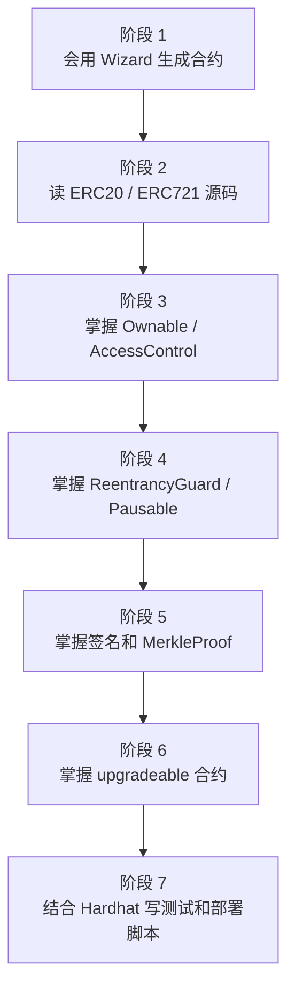

# OpenZeppelin 学习总览

本文档是 OpenZeppelin 学习入口，适合配合当前 Hardhat 3 项目阅读。

当前项目已经安装：

```text
@openzeppelin/contracts@5.6.1
@openzeppelin/contracts-upgradeable@5.6.1
```

所以学习时建议直接看 OpenZeppelin Contracts 5.x，不要混用 4.x 老教程。

## 1. 先明确 OpenZeppelin 是什么

OpenZeppelin Contracts 是一套经过大量项目使用和审计的 Solidity 合约库。它不是一个“自动帮你写业务”的框架，而是一组可靠的基础模块：

| 模块 | 解决什么问题 |
| --- | --- |
| Token | ERC20、ERC721、ERC1155 等标准资产合约。 |
| Access | `Ownable`、`AccessControl`、`AccessManager` 等权限控制。 |
| Utils | `ReentrancyGuard`、`Pausable`、`Strings`、`Address` 等工具。 |
| Cryptography | `ECDSA`、`EIP712`、`MerkleProof` 等签名和证明工具。 |
| Proxy | `ERC1967Proxy`、`UUPSUpgradeable` 等代理升级能力。 |

学习 OpenZeppelin 的重点不是背 API，而是理解：

```text
1. 这个模块防什么问题。
2. 这个模块不防什么问题。
3. 业务合约应该继承哪个模块。
4. 应该重写哪个 hook 或 internal function。
5. 测试中应该验证哪些权限和异常路径。
```

## 2. 推荐学习顺序

不要一开始就学习所有模块。建议按下面顺序：



### 阶段 1：先会用

目标：

- 能用 OpenZeppelin Wizard 生成 ERC20、ERC721、权限合约。
- 能把生成的代码复制到 `contracts/`。
- 能用 `npm run build` 编译通过。

建议练习：

```text
1. 生成一个 ERC20 固定总量代币。
2. 生成一个 ERC721 NFT。
3. 给 ERC20 加 Ownable 和 mint。
4. 给 ERC721 加 pause。
```

### 阶段 2：再读源码

源码阅读不要从所有文件开始。先读最常用的 3 个：

```text
node_modules/@openzeppelin/contracts/token/ERC20/ERC20.sol
node_modules/@openzeppelin/contracts/access/Ownable.sol
node_modules/@openzeppelin/contracts/utils/ReentrancyGuard.sol
```

读源码时只追主链路：

```text
ERC20.transfer()
  -> _transfer()
    -> _update()

ERC20.transferFrom()
  -> _spendAllowance()
  -> _transfer()
    -> _update()

Ownable.onlyOwner
  -> _checkOwner()
```

不要一上来就把所有 import 都展开，否则会迷失在接口、事件、错误定义里。

### 阶段 3：学习权限

先学 `Ownable`，再学 `AccessControl`。

| 模块 | 适合场景 |
| --- | --- |
| `Ownable` | 只有一个管理员，例如作业合约、简单 mint 合约、小型项目。 |
| `AccessControl` | 多个角色，例如 minter、burner、operator、admin。 |
| `AccessManager` | 更复杂的生产级权限管理，后期再学。 |

学习目标：

```text
1. 知道 onlyOwner 做了什么。
2. 知道 transferOwnership 和 renounceOwnership 的影响。
3. 知道 DEFAULT_ADMIN_ROLE 风险很高。
4. 知道每个敏感函数都必须有明确权限边界。
```

### 阶段 4：学习安全模块

重点模块：

| 模块 | 作用 |
| --- | --- |
| `ReentrancyGuard` | 防止重入调用。 |
| `Pausable` | 紧急暂停核心操作。 |
| `ERC721Holder` | 让合约能安全接收 ERC721。 |

学习目标：

```text
1. 知道 nonReentrant 应该放在哪些外部入口函数上。
2. 知道 nonReentrant 不能替代业务校验。
3. 知道暂停功能通常只暂停关键写操作，不一定暂停 view 函数。
4. 知道接收 NFT 时为什么需要 ERC721Holder。
```

### 阶段 5：学习签名和证明

后面做白名单、空投、订单签名时会用：

| 模块 | 常见用途 |
| --- | --- |
| `ECDSA` | 验证后端签名。 |
| `EIP712` | 结构化签名，适合订单、授权、permit 风格数据。 |
| `MerkleProof` | 白名单 mint、空投名单证明。 |

建议等 ERC20、权限、安全模块熟悉后再学。

### 阶段 6：学习升级合约

升级合约和普通合约的最大区别：

```text
普通合约：constructor 初始化
升级合约：initialize 初始化
```

重点规则：

```text
1. 不要在 upgradeable 合约里写业务 constructor。
2. implementation constructor 中通常只调用 _disableInitializers()。
3. 初始化逻辑写在 initialize()。
4. 升级时不能破坏 storage layout。
5. UUPS 升级必须实现 _authorizeUpgrade。
```

当前项目已经有代理升级专题文档：

```text
docs/PROXY_AND_UPGRADE_GUIDE.md
```

学习 OpenZeppelin 升级模块时建议一起看。

## 3. 本目录相关学习文档

本次整理了 4 个 OpenZeppelin 学习文档：

| 文档 | 主题 |
| --- | --- |
| `OPENZEPPELIN_LEARNING_INDEX.md` | 学习总览和路线。 |
| `OPENZEPPELIN_ERC20_SOURCE_GUIDE.md` | ERC20 源码阅读、继承和扩展示例。 |
| `OPENZEPPELIN_ACCESS_SECURITY_GUIDE.md` | Ownable、AccessControl、ReentrancyGuard、Pausable。 |
| `OPENZEPPELIN_HARDHAT_PRACTICE_GUIDE.md` | 在当前 Hardhat 3 项目中练习 OpenZeppelin。 |

建议阅读顺序：

```text
1. OPENZEPPELIN_LEARNING_INDEX.md
2. OPENZEPPELIN_ERC20_SOURCE_GUIDE.md
3. OPENZEPPELIN_ACCESS_SECURITY_GUIDE.md
4. OPENZEPPELIN_HARDHAT_PRACTICE_GUIDE.md
5. PROXY_AND_UPGRADE_GUIDE.md
```

## 4. 官方资料

建议收藏这些官方入口：

| 资料 | 地址 |
| --- | --- |
| OpenZeppelin Contracts 5.x | https://docs.openzeppelin.com/contracts/5.x/ |
| Contracts API | https://docs.openzeppelin.com/contracts/5.x/api/token/erc20 |
| Access Control | https://docs.openzeppelin.com/contracts/5.x/access-control |
| Contracts Wizard | https://wizard.openzeppelin.com/ |
| Upgrade Plugins | https://docs.openzeppelin.com/upgrades-plugins/ |

注意：

```text
优先看官方 5.x 文档。
如果搜索到 4.x 教程，先确认构造函数、hook、导入路径是否和 5.x 一致。
```

## 5. 学习时的检查清单

每学一个模块，都按这个清单检查：

```text
1. 这个模块的 import 路径是什么？
2. 它是通过继承使用，还是通过 library 调用？
3. 它暴露了哪些 public/external 函数？
4. 它提供了哪些 internal 函数给子合约使用？
5. 它有哪些 modifier？
6. 它有哪些 event 和 custom error？
7. 哪些函数应该被业务合约重写？
8. 哪些行为必须写测试？
```

如果能回答这些问题，才算不是只会复制代码。

