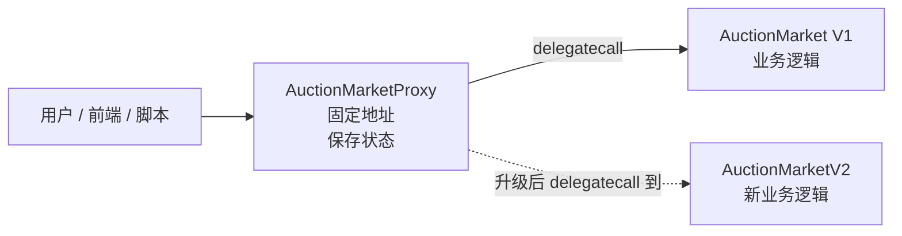
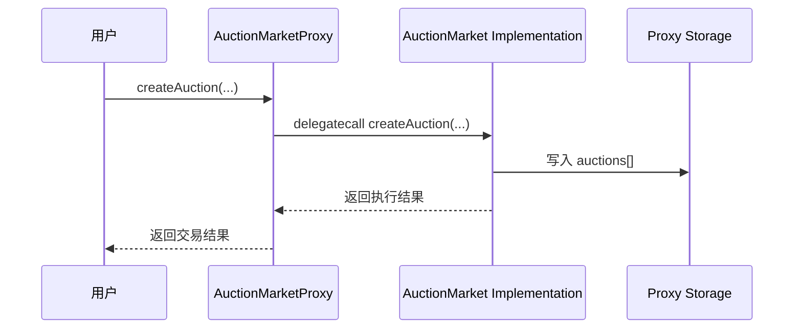
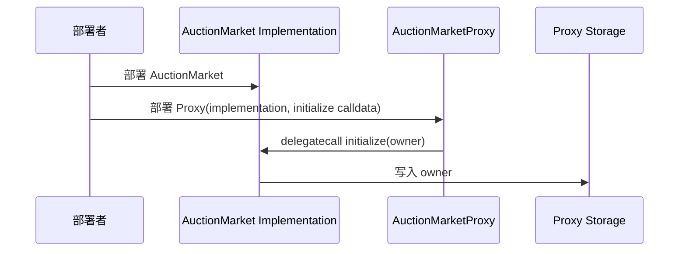
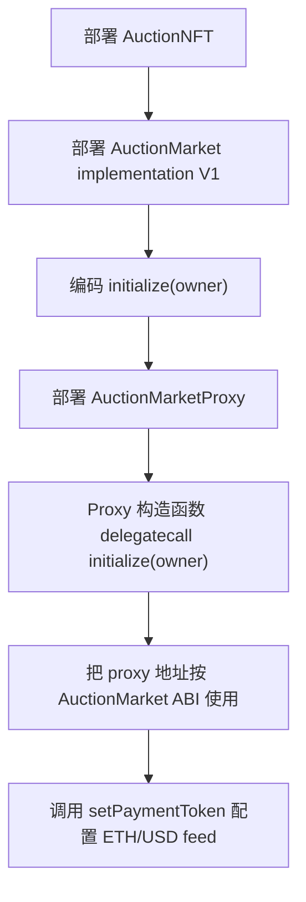
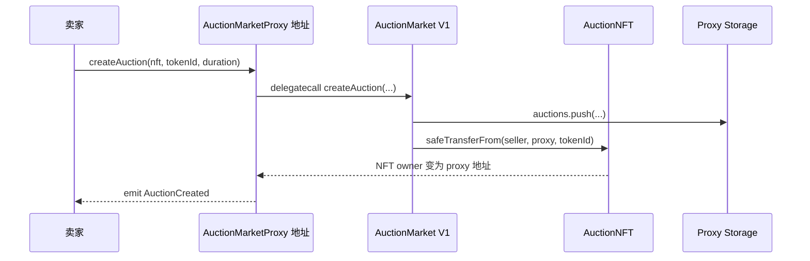
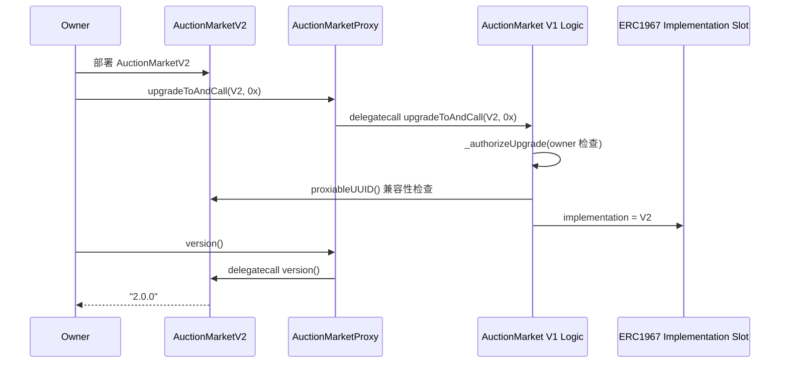

# 合约代理与升级专题说明

本文档专门解释本项目里的代理合约和升级机制。目标是把几个容易混淆的概念讲清楚：

- 为什么普通合约不能直接升级。
- 代理合约 Proxy 是什么。
- 实现合约 Implementation 是什么。
- `delegatecall` 为什么能让“逻辑在实现合约，状态在代理合约”。
- UUPS 升级到底升级了什么。
- 本项目的 `AuctionMarketProxy`、`AuctionMarket`、`AuctionMarketV2` 分别负责什么。
- 如何部署、如何升级、升级时要注意什么。

## 1. 先理解普通合约为什么不能升级

普通 Solidity 合约部署后，合约代码会固定在链上。你可以继续调用它的函数，也可以修改它保存的状态，但不能修改它的代码。

例如普通部署：

```text
用户 -> AuctionMarket 合约地址
```

如果这个 `AuctionMarket` 里有 bug，或者后面要新增功能，旧合约代码不能原地修改。常见选择只有：

```text
1. 重新部署一个 AuctionMarketV2
2. 通知所有用户以后改用新地址
3. 想办法迁移旧合约状态
```

问题：

- 用户要换地址。
- 前端、脚本、文档都要改。
- 旧合约里的拍卖状态、余额、配置不容易迁移。
- 如果市场已经在使用，迁移成本很高。

代理模式就是为了解决这个问题。

## 2. 代理模式的核心思想

代理模式把一个合约拆成两个部分：

```text
Proxy          保存地址和状态，用户永远调用它
Implementation 保存业务逻辑，可以被替换
```

本项目中：

| 角色 | 本项目文件 | 作用 |
| --- | --- | --- |
| Proxy | `contracts/AuctionMarketProxy.sol` | 用户实际调用的市场地址，保存状态，转发调用。 |
| Implementation V1 | `contracts/AuctionMarket.sol` | 第一版拍卖市场逻辑。 |
| Implementation V2 | `contracts/AuctionMarketV2.sol` | 第二版逻辑，保留 `version()`，并扩展手续费配置和卖家净收入结算。 |

整体关系：



最重要的一句话：

> 用户一直调用 Proxy 地址，升级时只更换 Proxy 指向的 Implementation 地址。

## 3. Proxy、Implementation、Storage 分别是什么

### 3.1 Proxy

Proxy 是用户实际交互的合约。

它负责：

- 保存业务状态。
- 保存当前 implementation 地址。
- 接收用户调用。
- 把调用转发给 implementation。

本项目的代理合约：

```solidity
contract AuctionMarketProxy is ERC1967Proxy {
  constructor(
    address implementation,
    bytes memory data
  ) ERC1967Proxy(implementation, data) {}
}
```

它继承 OpenZeppelin `ERC1967Proxy`。本项目没有自己手写复杂代理逻辑，代理行为由 OpenZeppelin 实现。

### 3.2 Implementation

Implementation 是业务逻辑合约。

本项目 V1 是：

```text
contracts/AuctionMarket.sol
```

它包含：

- `createAuction`
- `bidWithEth`
- `bidWithToken`
- `endAuction`
- `quoteBidUsd`
- `setPaymentToken`
- `upgradeToAndCall`

但是用户不应该直接使用 implementation 地址，而是使用 proxy 地址。

### 3.3 Storage

Storage 是链上保存状态的地方。

在代理模式中，业务状态保存在 Proxy 里，不保存在 Implementation 里。

本项目中这些状态都实际存储在 Proxy 地址上：

```solidity
Auction[] public auctions;
mapping(address token => PaymentTokenConfig config) public paymentTokens;
```

所以升级 implementation 后，拍卖数据不会丢。

## 4. delegatecall 是关键

普通 `call` 和 `delegatecall` 的区别：

| 调用方式 | 执行谁的代码 | 修改谁的状态 | `address(this)` 是谁 |
| --- | --- | --- | --- |
| `call` | 被调用合约的代码 | 被调用合约的状态 | 被调用合约地址 |
| `delegatecall` | 被调用合约的代码 | 调用方合约的状态 | 调用方合约地址 |

代理使用的是 `delegatecall`。

也就是：

```text
用户调用 Proxy
Proxy delegatecall 到 AuctionMarket
执行 AuctionMarket 的代码
但读写的是 Proxy 的 storage
```

示意图：



这就是为什么：

- 代码来自 implementation。
- 状态保存在 proxy。
- 升级 implementation 后状态还在。

## 5. 本项目的 UUPS 升级是什么

UUPS 是一种代理升级模式。

它的特点：

- Proxy 很薄，只负责 delegatecall 和保存 implementation 地址。
- 升级函数放在 Implementation 里。
- 权限检查也放在 Implementation 里。

本项目 `AuctionMarket` 继承：

```solidity
contract AuctionMarket is
  Initializable,
  OwnableUpgradeable,
  UUPSUpgradeable,
  ERC721Holder
```

其中：

| 父合约 | 作用 |
| --- | --- |
| `Initializable` | 让代理合约可以用 `initialize` 初始化状态。 |
| `OwnableUpgradeable` | 保存 owner，用 `onlyOwner` 做权限控制。 |
| `UUPSUpgradeable` | 提供 `upgradeToAndCall` 等 UUPS 升级逻辑。 |
| `ERC721Holder` | 让市场合约可以接收安全转入的 NFT。 |

升级权限在这里：

```solidity
function _authorizeUpgrade(address newImplementation) internal override onlyOwner {}
```

这行代码的意思：

```text
只有 owner 可以升级 implementation。
```

## 6. 为什么代理合约不能用 constructor 初始化业务状态

普通合约通常用 constructor 初始化：

```solidity
constructor(...) {
  owner = msg.sender;
}
```

但代理模式中，用户调用的是 Proxy，业务逻辑在 Implementation。

如果把初始化逻辑写在 Implementation 的 constructor 里，只会初始化 Implementation 自己的 storage，不会初始化 Proxy 的 storage。

所以升级合约使用 `initialize`：

```solidity
function initialize(address initialOwner) external initializer {
  __Ownable_init(initialOwner);
}
```

部署代理时，把 `initialize(owner)` 编码成 calldata，传给 proxy 构造函数：

```ts
const initData = m.encodeFunctionCall(implementation, "initialize", [owner]);
const proxy = m.contract("AuctionMarketProxy", [implementation, initData]);
```

部署时发生的事情：



结果：

```text
owner 写入的是 Proxy 的 storage。
```

## 7. 为什么 implementation 构造函数里要 _disableInitializers()

`AuctionMarket` 里有：

```solidity
constructor() {
  _disableInitializers();
}
```

它的作用是锁住 implementation 合约本身，避免别人直接初始化 implementation。

为什么需要这样？

因为 implementation 也是一个真实部署的合约地址。如果它没有被锁住，别人可能直接调用 implementation 的 `initialize`，把 implementation 自己的 owner 改成攻击者。

虽然用户正常使用 proxy，但未锁定 implementation 是不好的安全习惯。OpenZeppelin 推荐升级合约在 constructor 中禁用初始化器。

注意：

```text
_disableInitializers() 锁的是 implementation 自己。
不会影响 proxy 通过 delegatecall 调用 initialize。
```

## 8. ERC1967 是什么

`AuctionMarketProxy` 继承的是：

```solidity
ERC1967Proxy
```

ERC1967 定义了代理合约里几个特殊 storage slot，用来保存 implementation 地址等代理内部数据。

为什么需要特殊 slot？

因为业务合约也有自己的状态变量，例如：

```solidity
Auction[] public auctions;
mapping(address => PaymentTokenConfig) public paymentTokens;
```

如果代理内部变量随便占用 storage slot，就可能和业务变量冲突。

ERC1967 使用固定、很难和业务变量冲突的 slot 保存 implementation 地址。

可以简单理解为：

```text
Proxy 普通 storage 区域：保存业务状态
Proxy 特殊 ERC1967 slot：保存 implementation 地址
```

## 9. 本项目部署时发生了什么

部署模块：

```text
ignition/modules/AuctionMarket.ts
```

核心代码：

```ts
const nft = m.contract("AuctionNFT", [nftName, nftSymbol, owner]);
const implementation = m.contract("AuctionMarket");
const initData = m.encodeFunctionCall(implementation, "initialize", [owner]);
const proxy = m.contract("AuctionMarketProxy", [implementation, initData]);
const market = m.contractAt("AuctionMarket", proxy, {
  id: "AuctionMarketProxyAsMarket",
});
```

部署顺序：



为什么 `contractAt("AuctionMarket", proxy)`？

因为 proxy 本身没有显式写 `setPaymentToken`、`createAuction` 等函数，这些函数在 implementation ABI 里。我们要用 `AuctionMarket` 的 ABI 去调用 proxy 地址。

也就是说：

```text
地址用 proxy 地址
ABI 用 AuctionMarket ABI
```

## 10. 用户调用市场时发生了什么

以创建拍卖为例：

```text
market.createAuction(nft, tokenId, duration)
```

真实发生：



注意 NFT 的 owner 会变成 proxy 地址，不是 implementation 地址。

原因是 delegatecall 执行时 `address(this)` 是 proxy。

## 11. 升级时到底改了什么

升级前：

```text
Proxy -> AuctionMarket V1
```

升级后：

```text
Proxy -> AuctionMarketV2
```

状态不动：

```text
Proxy storage 仍然是原来的 storage
auctions 仍然在
paymentTokens 仍然在
owner 仍然在
```

改动的是：

```text
Proxy 的 ERC1967 implementation slot
```

升级流程：



这里有一个容易误解的点：

> 升级函数虽然写在 implementation 里，但它是通过 proxy delegatecall 执行的，所以改的是 proxy 的 implementation slot。

## 12. 本项目的升级脚本

脚本：

```text
scripts/upgrade-auction-market.ts
```

核心流程：

```ts
const proxyAddress = process.env.AUCTION_MARKET_PROXY;
const v2 = await ethers.deployContract("AuctionMarketV2", [], owner);
const market = await ethers.getContractAt("AuctionMarket", proxyAddress, owner);
const tx = await market.upgradeToAndCall(v2Address, "0x");
const upgraded = await ethers.getContractAt("AuctionMarketV2", proxyAddress, owner);
console.log(await upgraded.version());
```

脚本做了几件事：

1. 从环境变量读取 proxy 地址。
2. 检查该地址上是否有合约代码。
3. 部署 `AuctionMarketV2`。
4. 用 `AuctionMarket` ABI 连接 proxy 地址。
5. 调用 `upgradeToAndCall`。
6. 用 `AuctionMarketV2` ABI 再连接同一个 proxy 地址。
7. 调用 `version()`，验证升级成功。
8. 升级后可以继续通过同一个 proxy 地址调用 V2 新增的 `setFeeConfig` 和 `calculateSellerNetProceeds`。

注意第 4 和第 6 步：

```text
升级前：用 V1 ABI 调 proxy 地址，因为要调用 upgradeToAndCall。
升级后：用 V2 ABI 调同一个 proxy 地址，因为要调用 version()、setFeeConfig() 等 V2 新方法。
```

## 13. 如何本地练习部署和升级

不要用 `hardhatMainnet` 直接分两条命令测试“先部署再升级”，因为 `hardhatMainnet` 是每条命令内的临时链。第一条命令结束后，链状态就没了。

正确方式是先启动持久节点：

```powershell
npx hardhat node --network hardhatMainnet
```

保持这个窗口不要关闭。

然后打开第二个 PowerShell 窗口，部署：

```powershell
npx hardhat ignition deploy ignition/modules/AuctionMarket.ts --network localhost
```

部署输出里记录：

```text
AuctionMarketModule#AuctionMarketProxy - 0x...
```

然后升级：

```powershell
$env:AUCTION_MARKET_PROXY="<上一步的 AuctionMarketProxy 地址>"
npm run upgrade:auction -- --network localhost
```

成功输出类似：

```text
Upgrade sender: 0xf39F...
AuctionMarket proxy: 0x9fE4...
AuctionMarketV2 implementation: 0xDc64...
Upgrade transaction: 0x...
Proxy version after upgrade: 2.0.0
```

## 14. 如何部署到 Sepolia 并升级

部署前设置环境变量：

```powershell
$env:SEPOLIA_RPC_URL="https://sepolia.infura.io/v3/<key>"
$env:SEPOLIA_PRIVATE_KEY="<private-key>"
```

部署：

```powershell
npx hardhat ignition deploy --network sepolia ignition/modules/AuctionMarket.ts
```

记录 proxy 地址：

```text
AuctionMarketModule#AuctionMarketProxy - 0x...
```

升级：

```powershell
$env:AUCTION_MARKET_PROXY="<Sepolia 上的 AuctionMarketProxy 地址>"
npm run upgrade:auction -- --network sepolia
```

升级前必须确认：

- 当前私钥对应账号是 owner。
- `AUCTION_MARKET_PROXY` 填的是 proxy 地址，不是 implementation 地址。
- 新实现合约已经通过测试。
- 新实现没有破坏 storage layout。

## 15. 存储布局为什么重要

代理升级最危险的点是 storage layout。

假设 V1 的状态变量是：

```solidity
uint256 public a; // slot 0
address public b; // slot 1
```

如果 V2 改成：

```solidity
address public b; // slot 0
uint256 public a; // slot 1
```

那升级后读取状态就会错位。因为 proxy storage 里原来 slot 0 放的是 `a`，但 V2 以为 slot 0 是 `b`。

所以升级合约时通常遵守：

```text
不能删除旧状态变量
不能调整旧状态变量顺序
不能修改旧状态变量类型
新状态变量只能追加到后面
```

本项目的 `AuctionMarketV2` 没有删除或移动 V1 的旧状态变量，只在继承链末尾追加了新状态变量：

```solidity
address public feeRecipient;
uint16 public platformFeeBps;
```

这种追加方式保持 storage layout 兼容。V2 还新增了这些业务方法：

```solidity
function version() external pure returns (string memory)
function setFeeConfig(address newFeeRecipient, uint16 newPlatformFeeBps) external
function calculateSellerNetProceeds(uint256 grossAmount) public view returns (uint256 feeAmount, uint256 sellerNetAmount)
```

## 16. 本项目升级前后状态为什么还在

因为拍卖状态保存在 proxy 中。

测试里验证了这一点：

```ts
const auction = await upgraded.auctions(0n);

expect(await upgraded.version()).to.equal("2.0.0");
expect(auction.seller).to.equal(seller.address);
expect(auction.nft).to.equal(await nft.getAddress());
```

这表示：

- `version()` 能调用，说明 proxy 已经使用 V2 逻辑。
- `auctions(0)` 还能读到旧拍卖，说明 proxy storage 没丢。

## 17. 为什么不是透明代理

常见升级模式有两种：

| 模式 | 升级函数在哪里 | 特点 |
| --- | --- | --- |
| Transparent Proxy | Proxy/Admin 侧 | 管理员和普通用户调用路径分开。 |
| UUPS Proxy | Implementation 侧 | Proxy 更轻，升级权限由实现合约控制。 |

本项目选择 UUPS，因为：

- 合约代码更贴近学习目标。
- 可以在 `AuctionMarket` 里直接看到升级权限 `_authorizeUpgrade`。
- `AuctionMarketProxy` 保持很薄。
- 测试和脚本能清楚展示从 V1 升级到 V2。

## 18. 常见错误

### 18.1 把 implementation 地址当成市场地址

错误：

```text
前端或脚本调用 AuctionMarket implementation 地址
```

正确：

```text
调用 AuctionMarketProxy 地址
```

Implementation 只是逻辑代码，不是用户主入口。

### 18.2 升级时填错地址

错误：

```powershell
$env:AUCTION_MARKET_PROXY="<implementation-address>"
```

正确：

```powershell
$env:AUCTION_MARKET_PROXY="<proxy-address>"
```

### 18.3 在临时链上分两条命令部署和升级

错误：

```powershell
npx hardhat ignition deploy ... --network hardhatMainnet
npm run upgrade:auction -- --network hardhatMainnet
```

原因：每条命令都会启动新的临时链，第二条命令找不到第一条命令部署的 proxy。

正确：

```powershell
npx hardhat node --network hardhatMainnet
npx hardhat ignition deploy ... --network localhost
npm run upgrade:auction -- --network localhost
```

### 18.4 新版本破坏 storage layout

错误：

```text
在 V2 删除、重排、改类型旧状态变量
```

正确：

```text
保留旧状态变量顺序，只在末尾追加新变量。
```

### 18.5 忘记权限

`upgradeToAndCall` 最终会执行：

```solidity
_authorizeUpgrade(newImplementation)
```

本项目这里有 `onlyOwner`，所以非 owner 调用会失败。

## 19. 用一句话总结

这个项目的代理升级可以这样理解：

```text
AuctionMarketProxy 是用户一直使用的市场地址。
AuctionMarket / AuctionMarketV2 是可以被替换的业务逻辑。
Proxy 用 delegatecall 执行业务逻辑，但状态永远保存在 Proxy。
升级时只改 Proxy 指向哪个 Implementation，旧拍卖数据不会丢。
```

## 20. 对照本项目文件

| 文件 | 和代理升级的关系 |
| --- | --- |
| `contracts/AuctionMarketProxy.sol` | 代理合约，用户实际调用地址。 |
| `contracts/AuctionMarket.sol` | V1 实现合约，包含业务逻辑和 UUPS 升级授权。 |
| `contracts/AuctionMarketV2.sol` | V2 实现合约，演示升级，并扩展手续费和卖家净收入结算。 |
| `ignition/modules/AuctionMarket.ts` | 部署 NFT、V1 implementation、proxy，并初始化。 |
| `scripts/upgrade-auction-market.ts` | 部署 V2，并把 proxy 升级到 V2。 |
| `test/AuctionMarket.ts` | 测试升级后状态仍保留，以及 V2 手续费结算。 |
